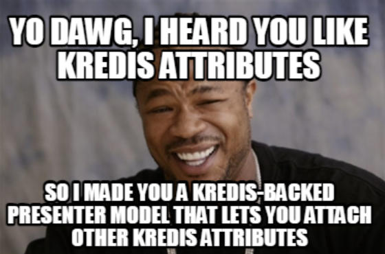

# Attributes

All Futures stands on the shoulders of two giants, [Active Entity](https://github.com/jasl/activeentity) and [Kredis](https://github.com/rails/kredis).

Active Entity presents a "virtual model" that is backed by [Redis](https://redis.io) instead of a relational database. By implementing [Active Model](https://guides.rubyonrails.org/active\_model\_basics.html), an All Futures model should be useful everywhere that you might usually use an Active Record model in your Rails app.

Instead of creating migrations, All Futures model attributes are declared in the class using the `attribute` method. At minimum, you must specify a Symbol parameter for the name.

You can specify attributes with the following types: `:string`, `:text`, `:integer`, `:float`, `:decimal`, `:datetime`, `:date`, `:time`, and `:boolean`.

Attributes will automatically be `:string` type unless you pass a second Symbol parameter.

Optionally, you can define a `default` value, as well as flag an attribute as an `array`. Other types have their own special options, such as `Decimal`. Unfortunately, the `limit` and `null` options are disregarded.

So far as I can tell, `:text` is a `:string` and `:time` is a `:datetime`. While you can specify type `:binary`, Active Entity gets a bit salty, throwing an `Encoding::UndefinedConversionError` exception when you attempt to save.

### Aggregations

Active Model classes include a `composed_of` method which provides model instances with dynamic methods that map attributes to complex classes.

For example, you could map an address to an `Address` class:

```ruby
composed_of :address, mapping: [ %w(address_street street), %w(address_city city) ]
```

And then you can call these getters and setters to access the members of the `Address` class:

```ruby
customer.address_street = "Hyancintvej"
customer.address_city   = "Copenhagen"
customer.address        # => Address.new("Hyancintvej", "Copenhagen")

customer.address = Address.new("May Street", "Chicago")
customer.address_street # => "May Street"
customer.address_city   # => "Chicago"
```

You can [learn more](https://api.rubyonrails.org/classes/ActiveRecord/Aggregations/ClassMethods.html) in the Rails Guide.

### Arrays

```ruby
attribute :tags, :string, array: true, default: []
```

When defining an Array, it's good practice to make sure that your `default` value is an empty Array. This is true with Postgres-backed Active Record migrations as well.

### Decimal

```ruby
attribute :lat, :decimal, :precision => 15, :scale => 10
attribute :lng, :decimal, :precision => 15, :scale => 10
```

The precision represents the total number of digits in the number, whereas scale represents the number of digits following the decimal point.

### Enums

You can use the `enum` class method to define a set of possible values for an attribute. It is similar to the `enum` functionality in Active Model, but has significant enough quirks that you should think of them as distinct.

```ruby
class Example < AllFutures::Base
  attribute :steve, :integer
  enum steve: [:martin, :carell, :buscemi]
end

example = Example.new
example.attributes # => {"steve"=>nil}
example.steve = :carell
example.carell? # => true
example.attributes # => {"steve"=>"carell"}
example.steve = 2
example.attributes # => {"steve"=>"buscemi"}
example.martin! # => {"steve"=>"martin"} (attributes saved to Redis)
example.steve = :bannon # ArgumentError ('bannon' is not a valid steve)
```

The first thing you'll notice about the `:steve` attribute is that it is an "Integer", even though it might seem logical to define it as a String... TL;DR: **don't do this**. Even though the attribute is ultimately stored in Redis as a String, internally `enum` tracks the possible values based on their index position in the array. It's also possible to provide a Hash of possible values:

```ruby
class Example < AllFutures::Base
  attribute :steve, :integer, default: 9
  enum steve: {martin: 5, carell: 12, buscemi: 9}
end

example = Example.new
example.attributes # => {"steve"=>"buscemi"}
```

The other quirk of this implementation is that you must create your `attribute` **before** you call `enum`.

`enum` does not create the search scopes that might be familar to Active Model users, since there is no `ActiveRecord::Relation` or scope concept in All Futures. You can, however, access the mapping directly to obtain the index number for a given value:

```ruby
Example.steves[:buscemi] # => 9
```

You can define prefixes and suffixes for your enum attributes. Note the underscores:

```ruby
class Conversation < AllFutures::Base
  attribute :status, :integer
  attribute :comments_status, :integer
  enum status: [ :active, :archived ], _suffix: true
  enum comments_status: [ :active, :inactive ], _prefix: :comments
end

conversation = Conversation.new
conversation.active_status!
conversation.archived_status? # => false

conversation.comments_inactive!
conversation.comments_active? # => false
```

### Kredis attributes



Kredis attributes can be used in an All Futures model in the exact same way they are used in Active Record models. The format follows a predictable pattern: `kredis_datatype`:

```ruby
class Example < AllFutures::Base
  kredis_string :foo
  kredis_flag :bar
end
```

This will create a new Redis key/value pair that is fully managed by Kredis, and accessed via the `foo` accessor of your `Example` instances. The `kredis_counter`, `kredis_unique_list` and `kredis_slots` are all really useful tools.

You can set and retrieve values from Kredis attributes using the `value` method:

```ruby
example = Example.new
example.foo.value = "baz"
```


All instances of your All Futures model will **share** the same Kredis attribute values. Advanced users can experiment with using a Proc to pass a unique value when the class is instantiated.


It's important to remember that Kredis attributes are **not** tracked as All Futures attributes, and they are stored in entirely different Redis keys.

### Secure Passwords

All Futures models can store and authenticate [secure passwords](https://guides.rubyonrails.org/active\_model\_basics.html#securepassword). You store the digest value in an attribute instead of using `attr_accessor`.

```ruby
class Example < AllFutures::Base
  has_secure_password
  attribute :password_digest
```

You can now set values for the `password` and `password_confirmation` attributes. `valid?` will return `false` and the `errors` accessor will contain an `ActiveModel::Error` exception if the two values aren't present or don't match.

You can check to see if a password is valid using the `authenticate(value)` method.


In order to use the secure password mechanism, your application must require the `bcrypt` gem. If you use Devise, it's already in your project.

